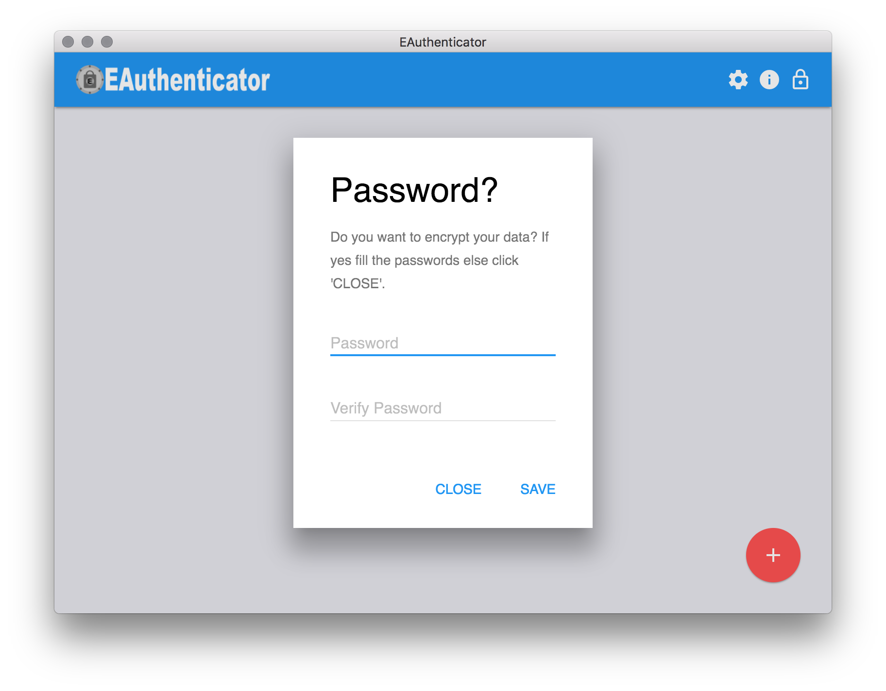
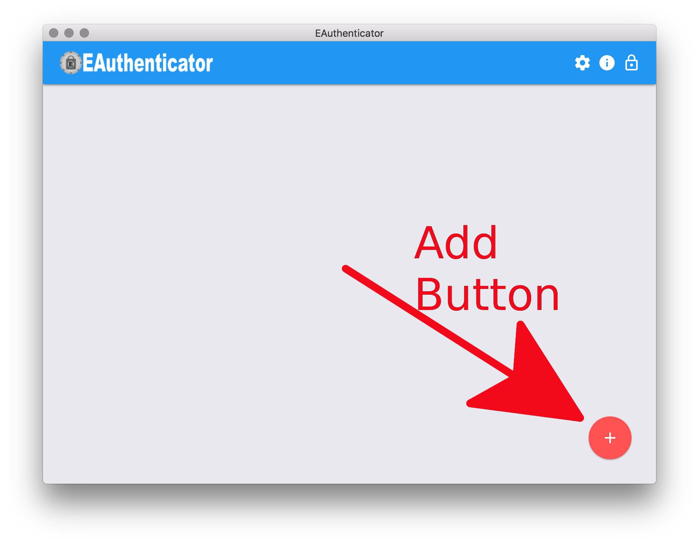
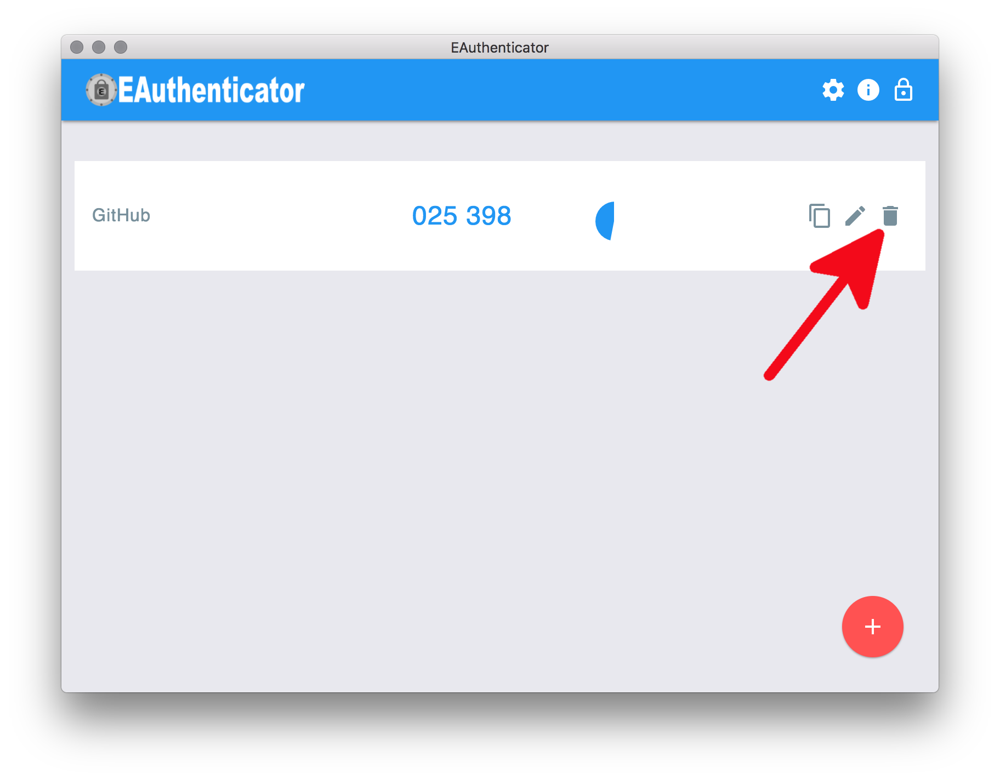
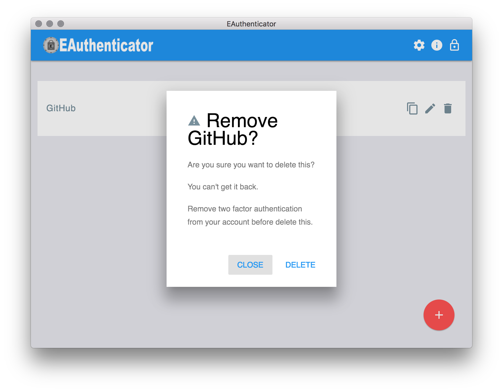
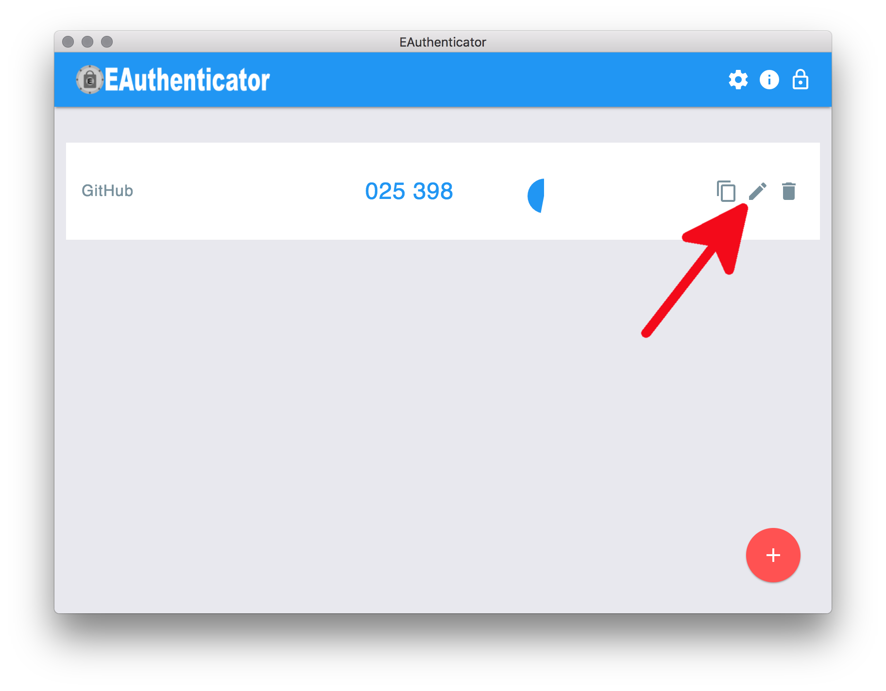
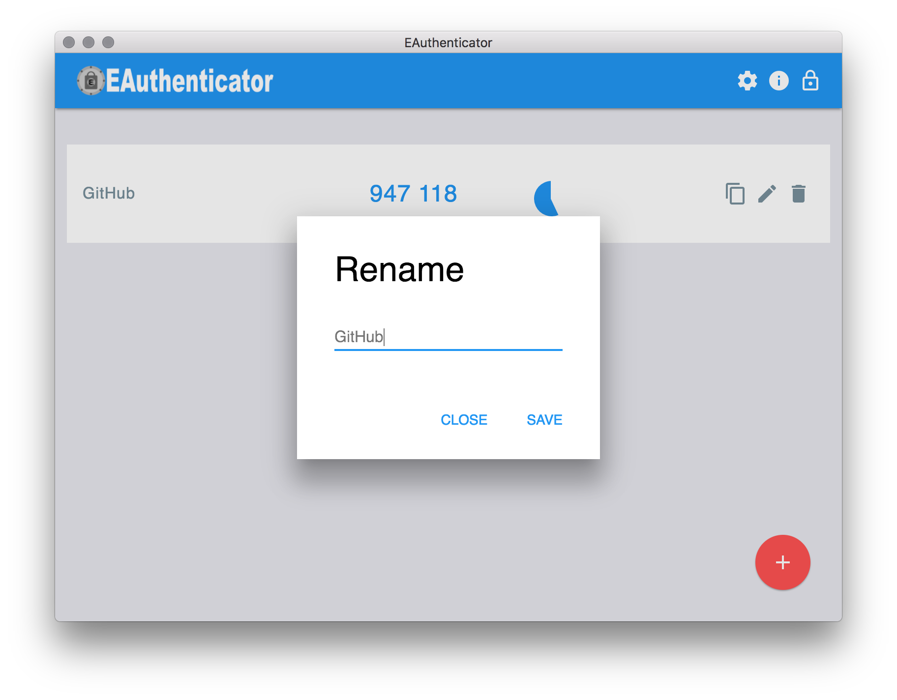
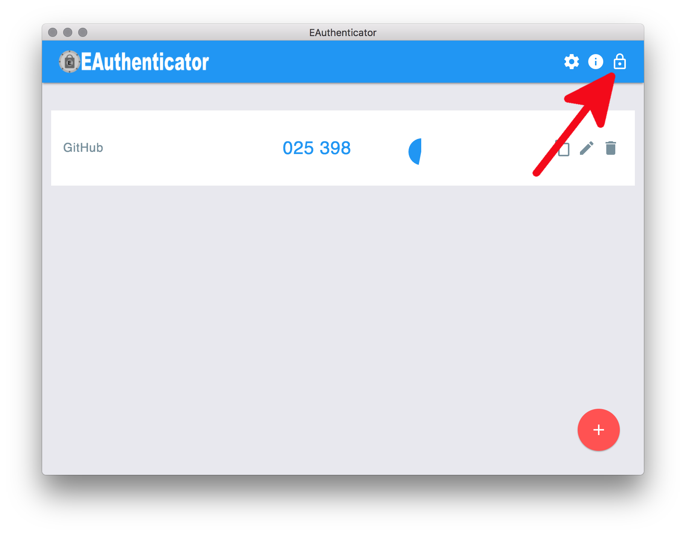
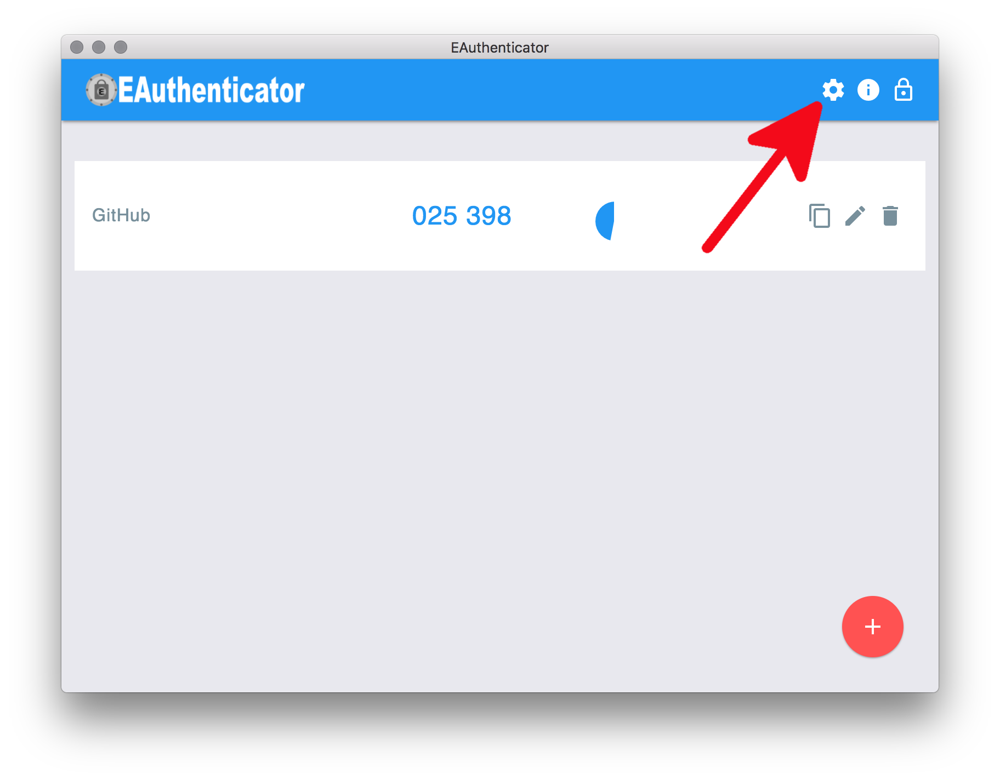
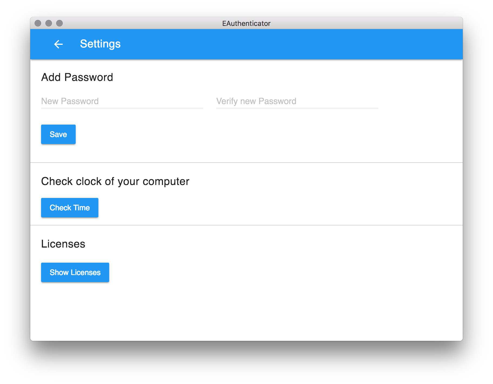
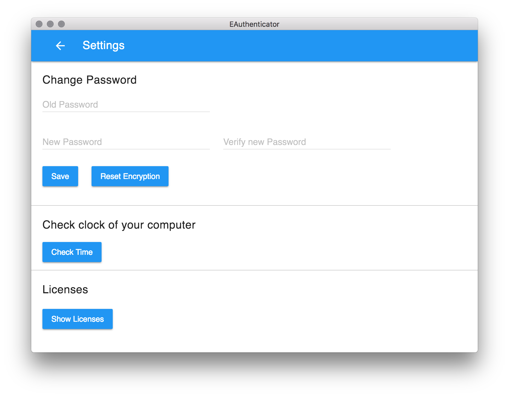

# An Electron Desktop app compatible with Google Authenticator


This is an open source two-factor authentication software which encrypts your data by default. It uses [electron](https://electronjs.org/) and it is similarly designed to [Google Authenticator](https://play.google.com/store/apps/details?id=com.google.android.apps.authenticator2). This gives it the name 'EAuthenticator'. EAuthenticator is an easy to use Authenticator for desktop operating systems. At the moment EAuthenticator only supports Time-based One-Time Password algorithm (TOTP) [RFC 6238](https://tools.ietf.org/html/rfc6238).

## Security Information

**The basic idea of two-factor authentication is the use of different devices for your password and TOTP pin. Using this software on the same device as your login reduces the security level. Nevertheless, the use of this software on the same device is safer than completely waiving no two-factor authentication.**

## How to USE

### Standard view
The following picture shows the standard functionalities of the application:


### On first start
On the first start, a dialog will be shown. This dialog let you specify a password for your accounts. If you click 'CLOSE' the accounts will also be encrypted, but with a default password. The dialog looks like this:




### Add an account
To add a account you have to click the red plus button



In the new window you can specify the account name and the shared secret of your two-factor authentication account.


Only time based two-factor authentication is possible in the current version.

### Delete an account
To delete a account you have to click the corresponding bin icon:



The following dialog will pop up:




### Rename an account
To rename a account you have to click the corresponding pencil icon:



The following dialog will pop up:




### Lock app
If you click the lock icon on the title bar the app will be locked. This means your in memory data will be removed. If you don't specify a password it's not possible to lock the app.




### Add encryption
To add a personal password you need to go to the settings view. Therefor click the gear icon in the title bar.



There specify a new password:




### Reset encryption

To reset the personal password you need to go to the settings view. Therefor click the gear icon in the title bar.


There fill in the old password and click 'Reset encryption'.



If you fill in a new password you can change your password with clicking 'Save'.

## How to BUILD

1. Install npm for your operating system

2. Install dependencies

   ```
   npm install
   ```

3. Generate the licenses.json file. This is necessary to show the licenses in the application

    ```
    npm run license
    ```

4. Optional: To try the software run the following command

    ```
    npm start
    ```
5. Optional: Run unit tests

    ```
    npm test
    ```
### Build for Linux via Flatpak
Note: Build this on a Linux operating system.

1. Install flatpak and the flatpak runtime for your operating system.

2. Install flatpak-builder for your operating system

3. Run the following command to package a executable
    ```
    npm run package-linux
    ```
4. Create an installer with
     ```
     npm run create-installer-linux
     ```
The flatpak file will be in the directory release-builds/installers

### Build for Windows


### Build for macOS
Note: Build this on macOS.

1. Run the following command to package a executable
    ```
    npm run package-mac
    ```
2. Create an installer with
     ```
     npm run create-installer-mac
     ```


## Storage design

Coming soon

## License

This software is licensed under GPL-3.0.

## Contributing

Feel free to contribute to this project. Look at the issues or add issues.