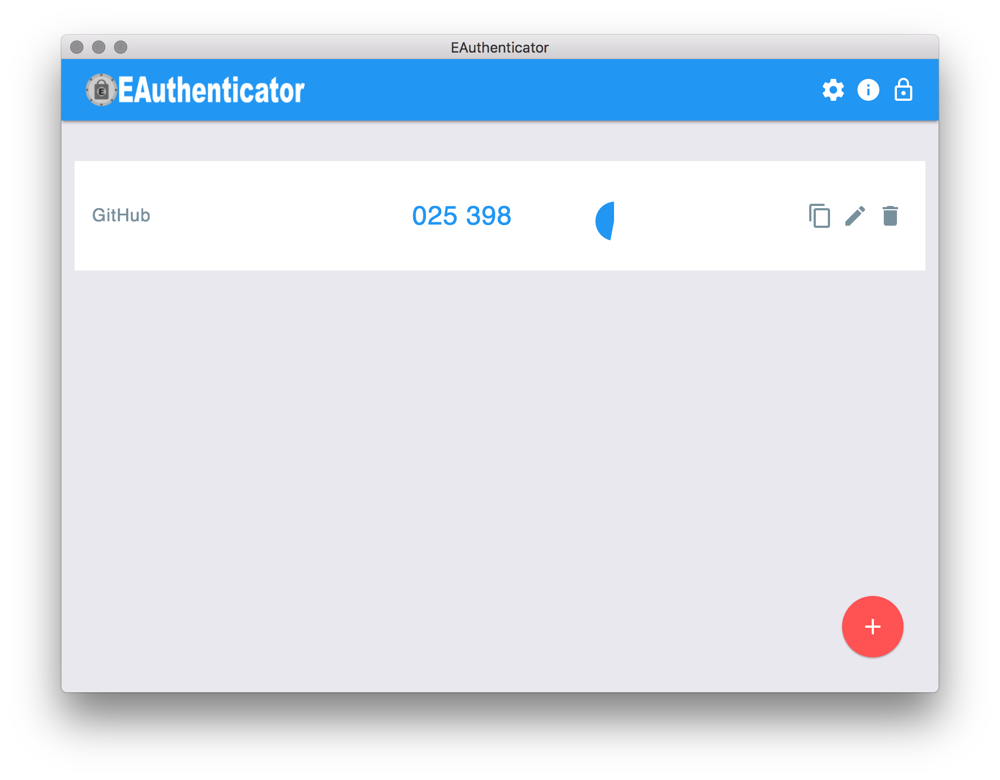

# An Electron Desktop app compatible with Google Authenticator


This is an open source two-factor authentication software which encrypts your data by default. It uses [electron](https://electronjs.org/) and it is similarly designed to [Google Authenticator](https://play.google.com/store/apps/details?id=com.google.android.apps.authenticator2). This gives it the name 'EAuthenticator'. EAuthenticator is an easy to use Authenticator for desktop operating systems. At the moment EAuthenticator only supports Time-based One-Time Password Algorithm (TOTP) [RFC 6238](https://tools.ietf.org/html/rfc6238).

## Security Information

**The basic idea of two-factor authentication is the use of different devices for your password and TOTP pin. Using this software on the same device as your login reduces the security level. Nevertheless, the use of this software on the same device is safer than completely waiving no two-factor authentication.**

## How to USE

This is the standard view of the application:



For more information look at the corresponding [Wiki](https://github.com/Nikolasel/EAuthenticator/wiki/How-to-USE) page.

## How to BUILD

### Requirements for all platforms

1. Install [Node.js](https://nodejs.org/en/download/) and npm for your operating system

2. Clone the repository
    ```
    git clone https://github.com/Nikolasel/EAuthenticator.git
    ```

3. Change to the correct directory
    ```
    cd EAuthenticator
    ```
4. Install dependencies

   ```
   npm install
   ```

5. Generate the licenses.json file. This is necessary to show the licenses in the application

    ```
    npm run license
    ```
6. **Optional**: Run unit tests

    ```
    npm test
    ```
7. **Optional**: To try the software run the following command

    ```
    npm start
    ```
### Build for Linux
**Note: Build this on a Linux operating system.**

8. Run the following command to build executables
    ```
    npm run package-linux
    ```

#### Build .deb (for Ubuntu/Debian)

9. Create an installer with
     ```
     npm run create-installer-deb
     ```

#### Build .rpm (for Fedora/OpenSuse)

9. Install **rpmbuild**

    * Ubuntu
        ```
        sudo apt-get install rpm
        ```
    * Fedora
      ```
      sudo dnf install rpm-build
       ```
10. Create an installer with
     ```
     npm run create-installer-rpm
     ```

### Build for Windows
**Note: Build this on Windows.**

8. Run the following command to build executables
    ```
    npm run package-win
    ```
9. Create an installer with
     ```
     npm run create-installer-win
     ```
     
### Build for macOS
**Note: Build this on macOS.**

8. Run the following command to build executables
    ```
    npm run package-mac
    ```
9. Create an installer with
     ```
     npm run create-installer-mac
     ```

## License

This software is licensed under GPL-3.0.

## Contributing

Feel free to contribute to this project. Look at the issues or add issues.
